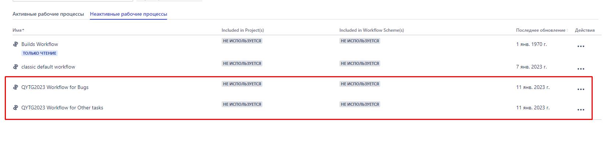
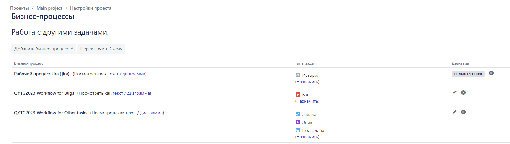
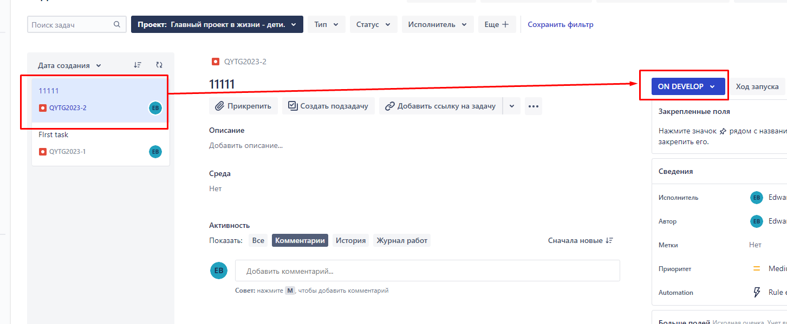

---
### Рабочий процесс для багов для первого типа проекта - управляемого командой.

---
### Рабочий процесс под другие задачи для первого типа проекта - управляемого командой.

---
## Создание рабочих процессов для второго типа проекта - управляемого компанией.
1) Переходим в Бизнес-процессы.
   Переходим в Закладку Неактивные рабочие процессы. Нажимаем справа сверху Добавить рабочий процесс.
   Создаем следующие бизнес- процессы 
---
### Список новых бизнес-процессов

---
### Рабочий процесс для багов

### Рабочий процесс для других задач

Создаем две новых схемы бизнес-процессов в закладке неактивных 
1) Работа с багами.
2) Работа с другими задачами.
и привязываем к ним соотвествующие  рабоиче процессы из  вновь созданных ранее и соответствующие типы задач.
Неназначенные задачи оставляем в Рабочий процесс Jira (jira) .

Переходим в настройки проекта

Добавляем созданные бизнес-процессы и нажимаем кнопку "Переключить схему" . 

Нажимаем справа сверху кнопку "Опубликовать"

Возвращаемся в проект и создаем новую доску Agile

Переходим в настройки проекта в "Бизнес-процессы" и привязываем  уже существующие типы задач к новым схемам.

Соглашаемся на перенесение уже существующих задач в новые статусы

Запускаем задачу и отслеживаем на КАНБАН доске

---
### Выгрузка схем workflow c помощью импорта в XML :

[https://github.com/edward-burlakov/mnt-homeworks/blob/master/07-software%20lifecycle-01/QYTG2023%20Workflow%20for%20Bugs.xml]

[https://github.com/edward-burlakov/mnt-homeworks/blob/master/07-software%20lifecycle-01/QYTG2023%20Workflow%20for%20Other%20tasks.xml]

