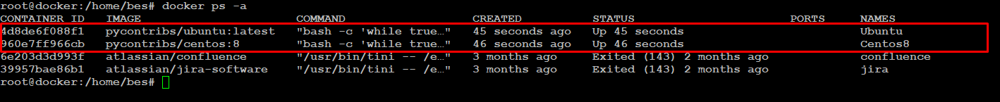
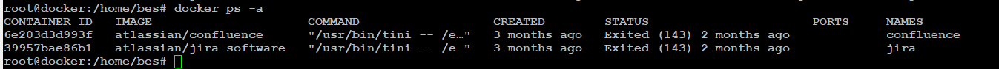

### Molecule
----

1) Убедимся предварительно, что необходимый драйвер  docker пакета-фреймворка molecule установлен.
   Сначала устанавливаем свежую версию molecule 4.0.0  вместо 3.5.2, иначе получим ошибку  
   ERROR: molecule-docker 2.1.0 has requirement molecule>=4.0.0, but you'll have molecule 3.5.2 which is incompatible.

            
            root@docker:/#  python3 -m pip install --upgrade "molecule==4.0.4"   
            root@docker:/#  python3 -m pip install --upgrade 'molecule[docker]'       
            ...
            Installing collected packages: websocket-client, docker, molecule-docker
            Successfully installed docker-6.0.1 molecule-docker-2.1.0 websocket-client-1.4.2

2) Проверяем версию молекулы

            root@docker:/# molecule --version
            molecule 4.0.0 using python 3.8
            ansible:2.13.6
            delegated:4.0.0 from molecule
            docker:2.1.0 from molecule_docker requiring collections: community.docker>=3.0.2 ansible.posix>=1.4.0
  
3) Проверяем версию Python / Устанавливаем  версии Python 3.8.10  и 3.9.16  на основании статьи 
   [https://medium.datadriveninvestor.com/how-to-install-and-manage-multiple-python-versions-on-linux-916990dabe4b]

4) Устанавливаем версию Python 3.9.16  версией по умолчанию  - -Press  <Ctrl> + <Z> .

            root@docker:/# pyenv global 3.9.16
            root@docker:/# python3
            Python 3.9.16 (main, Dec 24 2022, 03:29:44)
            [GCC 9.4.0] on linux
            Type "help", "copyright", "credits" or "license" for more information.
            >>>
            [2]+  Stopped                 python3

            

5) Убеждаемся, что необходимые линтеры YAMLLINT и  ANSIBLE-LINT установлены:
            
            root@docker:/# pip3 install ansible-lint yamllint
            root@docker:/# yamllint --version
            yamllint 1.28.0
            root@docker:/# ansible-lint --version
            ansible-lint 6.8.6 using ansible 2.13.6
            A new release of ansible-lint is available: 6.8.6 → 6.10.0

            root@docker:/# pip3 install git+https://github.com/ansible/ansible-lint.git
            Successfully installed ansible-compat-2.2.7 ansible-lint-6.10.1.dev2 pyyaml-6.0
            root@docker:/home/bes/vector-role/molecule/default# ansible-lint --version
            ansible-lint 6.10.1.dev2 using ansible 2.13.6
            You are using a pre-release version of ansible-lint.

6) Запускаем [molecule test -s centos_7] внутри корневой директории clickhouse-role ( Ошибка автора ? в уроке 8.4 ansible-clickhouse  ), смотрим на вывод команды.

            root@docker:/#  cd /etc/ansible/roles/ansible-clickhouse
            root@docker:/#  ls -la
            total 72
            drwxr-xr-x 10 root root  4096 Dec 21 05:56 .
            drwxr-xr-x  5 root root  4096 Dec 21 05:56 ..
            drwxr-xr-x  2 root root  4096 Dec 21 05:56 defaults
            drwxr-xr-x  3 root root  4096 Dec 21 05:56 .github
            -rw-rw-r--  1 root root    62 Jul 26 15:10 .gitignore
            drwxr-xr-x  2 root root  4096 Dec 21 05:56 handlers
            drwxr-xr-x  2 root root  4096 Dec 21 05:56 meta
            drwxr-xr-x 12 root root  4096 Dec 21 05:56 molecule
            -rw-rw-r--  1 root root 13124 Jul 26 15:10 README.md
            -rw-rw-r--  1 root root  1153 Jul 26 15:10 requirements-test.txt
            drwxr-xr-x  5 root root  4096 Dec 21 05:56 tasks
            drwxr-xr-x  2 root root  4096 Dec 21 05:56 templates
            -rw-rw-r--  1 root root   743 Jul 26 15:10 .travis.yml
            drwxr-xr-x  2 root root  4096 Dec 21 05:56 vars
            -rw-rw-r--  1 root root   598 Jul 26 15:10 .yamllint

            root@docker:/#  molecule test -s centos_7
            root@docker:/etc/ansible/roles/ansible-clickhouse# molecule test -s centos_7
            root@docker:/home/bes/LESSONS/08-ansible-04-roles/playbook/roles/ansible-clickhouse# molecule  test -s centos_7
            INFO     centos_7 scenario test matrix: dependency, lint, cleanup, destroy, syntax, create, prepare, converge, idempotence, side_effect, verify, cleanup, destroy
            INFO     Performing prerun with role_name_check=0...
            INFO     Set ANSIBLE_LIBRARY=/root/.cache/ansible-compat/b9a93c/modules:/root/.ansible/plugins/modules:/usr/share/ansible/plugins/modules
            INFO     Set ANSIBLE_COLLECTIONS_PATH=/root/.cache/ansible-compat/b9a93c/collections:/root/.ansible/collections:/usr/share/ansible/collections
            INFO     Set ANSIBLE_ROLES_PATH=/root/.cache/ansible-compat/b9a93c/roles:/etc/ansible/roles
            INFO     Using /root/.cache/ansible-compat/b9a93c/roles/alexeysetevoi.clickhouse symlink to current repository in order to enable Ansible to find the role using its expected full name.
            INFO     Inventory /home/bes/LESSONS/08-ansible-04-roles/playbook/roles/ansible-clickhouse/molecule/centos_7/../resources/inventory/hosts.yml linked to /root/.cache/molecule/ansible-clickhouse/centos_7/inventory/hosts
            INFO     Inventory /home/bes/LESSONS/08-ansible-04-roles/playbook/roles/ansible-clickhouse/molecule/centos_7/../resources/inventory/group_vars/ linked to /root/.cache/molecule/ansible-clickhouse/centos_7/inventory/group_vars
            INFO     Inventory /home/bes/LESSONS/08-ansible-04-roles/playbook/roles/ansible-clickhouse/molecule/centos_7/../resources/inventory/host_vars/ linked to /root/.cache/molecule/ansible-clickhouse/centos_7/inventory/host_vars
            INFO     Running centos_7 > dependency
            WARNING  Skipping, missing the requirements file.
            WARNING  Skipping, missing the requirements file.
            INFO     Inventory /home/bes/LESSONS/08-ansible-04-roles/playbook/roles/ansible-clickhouse/molecule/centos_7/../resources/inventory/hosts.yml linked to /root/.cache/molecule/ansible-clickhouse/centos_7/inventory/hosts
            INFO     Inventory /home/bes/LESSONS/08-ansible-04-roles/playbook/roles/ansible-clickhouse/molecule/centos_7/../resources/inventory/group_vars/ linked to /root/.cache/molecule/ansible-clickhouse/centos_7/inventory/group_vars
            INFO     Inventory /home/bes/LESSONS/08-ansible-04-roles/playbook/roles/ansible-clickhouse/molecule/centos_7/../resources/inventory/host_vars/ linked to /root/.cache/molecule/ansible-clickhouse/centos_7/inventory/host_vars
            INFO     Running centos_7 > lint
            Traceback (most recent call last):
            File "/root/.pyenv/versions/3.9.16/bin/ansible-lint", line 8, in <module>
            sys.exit(_run_cli_entrypoint())
            File "/root/.pyenv/versions/3.9.16/lib/python3.9/site-packages/ansiblelint/__main__.py", line 344, in _run_cli_entrypoint
            sys.exit(main(sys.argv))
            File "/root/.pyenv/versions/3.9.16/lib/python3.9/site-packages/ansiblelint/__main__.py", line 242, in main
            result = _get_matches(rules, options)
            File "/root/.pyenv/versions/3.9.16/lib/python3.9/site-packages/ansiblelint/runner.py", line 235, in _get_matches
            matches.extend(runner.run())
            File "/root/.pyenv/versions/3.9.16/lib/python3.9/site-packages/ansiblelint/runner.py", line 166, in run
            matches.extend(self._emit_matches(files))
            File "/root/.pyenv/versions/3.9.16/lib/python3.9/site-packages/ansiblelint/runner.py", line 204, in _emit_matches
            for child in ansiblelint.utils.find_children(lintable):
            File "/root/.pyenv/versions/3.9.16/lib/python3.9/site-packages/ansiblelint/utils.py", line 226, in find_children
            for child in play_children(basedir, item, lintable.kind, playbook_dir):
            File "/root/.pyenv/versions/3.9.16/lib/python3.9/site-packages/ansiblelint/utils.py", line 306, in play_children
            return delegate_map[k](basedir, k, v, parent_type)
            File "/root/.pyenv/versions/3.9.16/lib/python3.9/site-packages/ansiblelint/utils.py", line 318, in _include_children
            if "{{" in v:  # pragma: no branch
            TypeError: argument of type 'NoneType' is not iterable
            WARNING  Retrying execution failure 1 of: y a m l l i n t   .
            a n s i b l e - l i n t

            CRITICAL Lint failed with error code 1
            WARNING  An error occurred during the test sequence action: 'lint'. Cleaning up.
            INFO     Inventory /home/bes/LESSONS/08-ansible-04-roles/playbook/roles/ansible-clickhouse/molecule/centos_7/../resources/inventory/hosts.yml linked to /root/.cache/molecule/ansible-clickhouse/centos_7/inventory/hosts
            INFO     Inventory /home/bes/LESSONS/08-ansible-04-roles/playbook/roles/ansible-clickhouse/molecule/centos_7/../resources/inventory/group_vars/ linked to /root/.cache/molecule/ansible-clickhouse/centos_7/inventory/group_vars
            INFO     Inventory /home/bes/LESSONS/08-ansible-04-roles/playbook/roles/ansible-clickhouse/molecule/centos_7/../resources/inventory/host_vars/ linked to /root/.cache/molecule/ansible-clickhouse/centos_7/inventory/host_vars
            INFO     Running centos_7 > cleanup
            WARNING  Skipping, cleanup playbook not configured.
            INFO     Inventory /home/bes/LESSONS/08-ansible-04-roles/playbook/roles/ansible-clickhouse/molecule/centos_7/../resources/inventory/hosts.yml linked to /root/.cache/molecule/ansible-clickhouse/centos_7/inventory/hosts
            INFO     Inventory /home/bes/LESSONS/08-ansible-04-roles/playbook/roles/ansible-clickhouse/molecule/centos_7/../resources/inventory/group_vars/ linked to /root/.cache/molecule/ansible-clickhouse/centos_7/inventory/group_vars
            INFO     Inventory /home/bes/LESSONS/08-ansible-04-roles/playbook/roles/ansible-clickhouse/molecule/centos_7/../resources/inventory/host_vars/ linked to /root/.cache/molecule/ansible-clickhouse/centos_7/inventory/host_vars
            INFO     Running centos_7 > destroy
            INFO     Sanity checks: 'docker'

            PLAY [Destroy] *****************************************************************

            TASK [Set async_dir for HOME env] **********************************************
            ok: [localhost]
            
            TASK [Destroy molecule instance(s)] ********************************************
            changed: [localhost] => (item=centos_7)

            TASK [Wait for instance(s) deletion to complete] *******************************
            ok: [localhost] => (item=centos_7)

            TASK [Delete docker networks(s)] ***********************************************
            skipping: [localhost]

            PLAY RECAP *********************************************************************
            localhost                  : ok=3    changed=1    unreachable=0    failed=0    skipped=1    rescued=0    ignored=0

            INFO     Pruning extra files from scenario ephemeral directory

* Либо инициализируем новый  пустой макет роли со сценарием тестирования default с выбранным драйвером
     c помощью команды  "molecule init role vector-role --driver-name docker"

        root@docker:/#  molecule init role 'vector-role' --driver-name docker 
  
* Либо  переходим  в каталог   08-ansible-04-roles\playbook\roles\vector-role  из прошлого урока "LESSON 8.4"
  с уже существующей ролью vector-role, чтобы создать для molecule сценарий тестирования по умолчанию

       root@docker:/#  cd /home/bes/LESSON/08-ansible-04-roles\playbook\roles\vector-role   
       root@docker:/#  molecule init scenario default --driver-name docker
       INFO     Initializing new scenario default...
       INFO     Initialized scenario in /home/bes/vector-role/molecule/default successfully.

8) Добавляем несколько разных дистрибутивов (centos:8, ubuntu:latest) для инстансов и тестируем роль, исправляем найденные ошибки, если они есть.
          
            root@docker:/#  cat  /vector-role/molecule/default/molecule.yml
            ---
            dependency:
              name: galaxy
            driver:
              name: docker
            lint:
              ansible-lint .
              yamllint .
            platforms:
              - name: Centos8
                image: pycontribs/centos:8
                pre_build_image: true
              - name: Ubuntu
                image: pycontribs/ubuntu:latest
                pre_build_image: true

            provisioner:
              name: ansible
            verifier:
              name: ansible

9) Запускаем  полный сценарий тестирования .  
   На шаге dependency  необходимые пакеты скачиваются в каталог /root/.ansible/collections

         В режиме реального времени можно отслеживать состояние тестовых контейнеров 
         или запустив #molecule login -s default --name Centos8

         Можно отслеживать состояние с помощью  docker ps -a 
            а) В процессе выполнения фреймворка molecule
      

            б) После окончания работы фреймворка molecule
      
   
           root@docker:/#  molecule test -s default
           INFO     default scenario test matrix: dependency, lint, cleanup, destroy, syntax, create, prepare, converge, idempotence, side_effect, verify, cleanup, destroy
           INFO     Performing prerun with role_name_check=0...
           INFO     Set ANSIBLE_LIBRARY=/root/.cache/ansible-compat/f5bcd7/modules:/root/.ansible/plugins/modules:/usr/share/ansible/plugins/modules
           INFO     Set ANSIBLE_COLLECTIONS_PATH=/root/.cache/ansible-compat/f5bcd7/collections:/root/.ansible/collections:/usr/share/ansible/collections
           INFO     Set ANSIBLE_ROLES_PATH=/root/.cache/ansible-compat/f5bcd7/roles:/etc/ansible/roles
           INFO     Using /root/.cache/ansible-compat/f5bcd7/roles/edwardburlakov.vector symlink to current repository in order to enable Ansible to find the role using its expected full name.
           INFO     Running default > dependency
           WARNING  Skipping, dependency is disabled.
           WARNING  Skipping, dependency is disabled.
           INFO     Running default > lint

           Passed with production profile: 0 failure(s), 0 warning(s) on 10 files.
           INFO     Running default > cleanup
           WARNING  Skipping, cleanup playbook not configured.
           INFO     Running default > destroy
           INFO     Sanity checks: 'docker'

           PLAY [Destroy] *****************************************************************

           TASK [Set async_dir for HOME env] **********************************************
           ok: [localhost]
 
           TASK [Destroy molecule instance(s)] ********************************************
           changed: [localhost] => (item=Centos8)
           changed: [localhost] => (item=Ubuntu)

           TASK [Wait for instance(s) deletion to complete] *******************************
           ok: [localhost] => (item=Centos8)
           ok: [localhost] => (item=Ubuntu)

           TASK [Delete docker networks(s)] ***********************************************
           skipping: [localhost]

           PLAY RECAP *********************************************************************
           localhost                  : ok=3    changed=1    unreachable=0    failed=0    skipped=1    rescued=0    ignored=0

           INFO     Running default > syntax

           playbook: /home/bes/LESSONS/08-ansible-04-roles/playbook/roles/vector-role/molecule/default/converge.yml
           INFO     Running default > create

           PLAY [Create] ******************************************************************

           TASK [Set async_dir for HOME env] **********************************************
           ok: [localhost]

           TASK [Log into a Docker registry] **********************************************
           skipping: [localhost] => (item=None)
           skipping: [localhost] => (item=None)
           skipping: [localhost]

           TASK [Check presence of custom Dockerfiles] ************************************
           ok: [localhost] => (item={'image': 'pycontribs/centos:8', 'name': 'Centos8', 'pre_build_image': True})
           ok: [localhost] => (item={'image': 'pycontribs/ubuntu:latest', 'name': 'Ubuntu', 'pre_build_image': True})

           TASK [Create Dockerfiles from image names] *************************************
           skipping: [localhost] => (item={'image': 'pycontribs/centos:8', 'name': 'Centos8', 'pre_build_image': True})
           skipping: [localhost] => (item={'image': 'pycontribs/ubuntu:latest', 'name': 'Ubuntu', 'pre_build_image': True})
           skipping: [localhost]

           TASK [Synchronization the context] *********************************************
           skipping: [localhost] => (item={'image': 'pycontribs/centos:8', 'name': 'Centos8', 'pre_build_image': True})
           skipping: [localhost] => (item={'image': 'pycontribs/ubuntu:latest', 'name': 'Ubuntu', 'pre_build_image': True})
           skipping: [localhost]

           TASK [Discover local Docker images] ********************************************
           ok: [localhost] => (item={'changed': False, 'skipped': True, 'skip_reason': 'Conditional result was False', 'item': {'image': 'pycontribs/centos:8', 'name': 'Centos8', 'pre_build_image': True}, 'ansible_loop_var': 'item', 'i': 0, 'ansible_index_var': 'i'})
           ok: [localhost] => (item={'changed': False, 'skipped': True, 'skip_reason': 'Conditional result was False', 'item': {'image': 'pycontribs/ubuntu:latest', 'name': 'Ubuntu', 'pre_build_image': True}, 'ansible_loop_var': 'item', 'i': 1, 'ansible_index_var': 'i'})

           TASK [Build an Ansible compatible image (new)] *********************************
           skipping: [localhost] => (item=molecule_local/pycontribs/centos:8)
           skipping: [localhost] => (item=molecule_local/pycontribs/ubuntu:latest)
           skipping: [localhost]

           TASK [Create docker network(s)] ************************************************
           skipping: [localhost]

           TASK [Determinee the CMD directives] ********************************************
           ok: [localhost] => (item={'image': 'pycontribs/centos:8', 'name': 'Centos8', 'pre_build_image': True})
           ok: [localhost] => (item={'image': 'pycontribs/ubuntu:latest', 'name': 'Ubuntu', 'pre_build_image': True})

           TASK [Create molecule instance(s)] *********************************************
           changed: [localhost] => (item=Centos8)
           changed: [localhost] => (item=Ubuntu)

           TASK [Wait for instance(s) creation to complete] *******************************
           changed: [localhost] => (item={'failed': 0, 'started': 1, 'finished': 0, 'ansible_job_id': '676164706453.168159', 'results_file': '/root/.ansible_async/676164706453.168159', 'changed': True, 'item': {'image': 'pycontribs/centos:8', 'name': 'Centos8', 'pre_build_image': True}, 'ansible_loop_var': 'item'})
           changed: [localhost] => (item={'failed': 0, 'started': 1, 'finished': 0, 'ansible_job_id': '176382917463.168233', 'results_file': '/root/.ansible_async/176382917463.168233', 'changed': True, 'item': {'image': 'pycontribs/ubuntu:latest', 'name': 'Ubuntu', 'pre_build_image': True}, 'ansible_loop_var': 'item'})

           PLAY RECAP *********************************************************************
           localhost                  : ok=6    changed=2    unreachable=0    failed=0    skipped=5    rescued=0    ignored=0

           INFO     Running default > prepare
           WARNING  Skipping, prepare playbook not configured.
           INFO     Running default > converge

           PLAY [Converge] ****************************************************************

           TASK [Gathering Facts] *********************************************************
           ok: [Ubuntu]
           ok: [Centos8]

           TASK [Apply vector-role] *******************************************************

           TASK [vector-role : Export environment variables for Vector] *******************
           changed: [Ubuntu]
           changed: [Centos8]

           TASK [vector-role : Get Vector installed version] ******************************
           fatal: [Centos8]: FAILED! => {"changed": false, "cmd": "$HOME/.vector/bin/vector --version", "delta": "0:00:00.004081", "end": "2022-12-24 17:31:51.546108", "msg": "non-zero return code", "rc": 127, "start": "2022-12-24 17:31:51.542027", "stderr": "/bin/bash: /root/.vector/bin/vector: No such file or directory", "stderr_lines": ["/bin/bash: /root/.vector/bin/vector: No such file or directory"], "stdout": "", "stdout_lines": []}
           fatal: [Ubuntu]: FAILED! => {"changed": false, "cmd": "$HOME/.vector/bin/vector --version", "delta": "0:00:00.003557", "end": "2022-12-24 17:31:51.636265", "msg": "non-zero return code", "rc": 127, "start": "2022-12-24 17:31:51.632708", "stderr": "/bin/bash: /root/.vector/bin/vector: No such file or directory", "stderr_lines": ["/bin/bash: /root/.vector/bin/vector: No such file or directory"], "stdout": "", "stdout_lines": []}
           ...ignoring
           ...ignoring

           TASK [vector-role : Ensure installation dir exists and create if its not] ******
           changed: [Centos8]
           changed: [Ubuntu]

           TASK [vector-role : Get archive of Vector from remote URL] *********************
           changed: [Ubuntu]
           changed: [Centos8]

           TASK [vector-role : Extract Vector in the installation directory] **************
           changed: [Centos8]
           changed: [Ubuntu]

           TASK [vector-role : Copy distrib to working catalog] ***************************
           changed: [Centos8]
           changed: [Ubuntu]

           TASK [vector-role : Copy configuration file  for Vector] ***********************
           changed: [Centos8]
           changed: [Ubuntu]

           TASK [vector-role : Copy scriptfile  for Vector] *******************************
           changed: [Ubuntu]
           changed: [Centos8]

           TASK [vector-role : Execute Vector in the installation directory] **************
           ok: [Centos8]
           ok: [Ubuntu]

           PLAY RECAP *********************************************************************
           Centos8                    : ok=10   changed=7    unreachable=0    failed=0    skipped=0    rescued=0    ignored=1
           Ubuntu                     : ok=10   changed=7    unreachable=0    failed=0    skipped=0    rescued=0    ignored=1

           INFO     Running default > idempotence

           PLAY [Converge] ****************************************************************

           TASK [Gathering Facts] *********************************************************
           ok: [Ubuntu]
           ok: [Centos8]

           TASK [Apply vector-role] *******************************************************

           TASK [vector-role : Export environment variables for Vector] *******************
           ok: [Centos8]
           ok: [Ubuntu]

           TASK [vector-role : Get Vector installed version] ******************************
           ok: [Ubuntu]
           ok: [Centos8]

           TASK [vector-role : Ensure installation dir exists and create if its not] ******
           ok: [Centos8]
           ok: [Ubuntu]

           TASK [vector-role : Get archive of Vector from remote URL] *********************
           ok: [Centos8]
           ok: [Ubuntu]

           TASK [vector-role : Extract Vector in the installation directory] **************
           ok: [Ubuntu]
           ok: [Centos8]

           TASK [vector-role : Copy distrib to working catalog] ***************************
           changed: [Ubuntu]
           changed: [Centos8]

           TASK [vector-role : Copy configuration file  for Vector] ***********************
           changed: [Ubuntu]
           changed: [Centos8]

           TASK [vector-role : Copy scriptfile  for Vector] *******************************
           ok: [Centos8]
           ok: [Ubuntu]

           TASK [vector-role : Execute Vector in the installation directory] **************
           ok: [Centos8]
           ok: [Ubuntu]

           PLAY RECAP *********************************************************************
           Centos8                    : ok=10   changed=2    unreachable=0    failed=0    skipped=0    rescued=0    ignored=0
           Ubuntu                     : ok=10   changed=2    unreachable=0    failed=0    skipped=0    rescued=0    ignored=0

           CRITICAL Idempotence test failed because of the following tasks:
           * [Ubuntu] => vector-role : Copy distrib to working catalog
           * [Centos8] => vector-role : Copy distrib to working catalog
           * [Ubuntu] => vector-role : Copy configuration file  for Vector
           * [Centos8] => vector-role : Copy configuration file  for Vector
           WARNING  An error occurred during the test sequence action: 'idempotence'. Cleaning up.
           INFO     Running default > cleanup
           WARNING  Skipping, cleanup playbook not configured.
           INFO     Running default > destroy

           PLAY [Destroy] *****************************************************************

           TASK [Set async_dir for HOME env] **********************************************
           ok: [localhost]

           TASK [Destroy molecule instance(s)] ********************************************
           changed: [localhost] => (item=Centos8)
           changed: [localhost] => (item=Ubuntu)

           TASK [Wait for instance(s) deletion to complete] *******************************
           FAILED - RETRYING: [localhost]: Wait for instance(s) deletion to complete (300 retries left).
           changed: [localhost] => (item=Centos8)
           changed: [localhost] => (item=Ubuntu)

           TASK [Delete docker networks(s)] ***********************************************
           skipping: [localhost]

           PLAY RECAP *********************************************************************
           localhost                  : ok=3    changed=2    unreachable=0    failed=0    skipped=1    rescued=0    ignored=0

           INFO     Pruning extra files from scenario ephemeral directory

10) Переопределяем список тестов путем добавления сценария в файл module/default/molecule.yml

          scenario:
            test_sequence: 
              - destroy
              - create
              - converge
              - destroy

    Для проверки запускаем:

         # molecule matrix test

11) Добавляем несколько assert'ов в verify.yml файл для проверки работоспособности vector-role
    (проверка, что конфиг валидный, проверка успешности запуска, etc).

      

12) Запускаем тестирование роли повторно и проверяем, что оно прошло успешно.

13) Добавляем  новый тег на коммит с рабочим сценарием в соответствии с семантическим версионированием.
