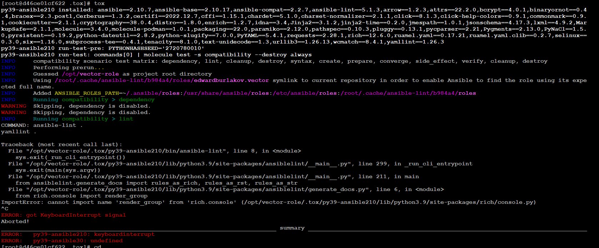

### Molecule
----

1) Убедимся предварительно, что необходимый драйвер  docker пакета-фреймворка molecule установлен.
   Сначала устанавливаем свежую версию molecule 4.0.0  вместо 3.5.2, иначе получим ошибку  
   ERROR: molecule-docker 2.1.0 has requirement molecule>=4.0.0, but you'll have molecule 3.5.2 which is incompatible.

            
            root@dockerhost:/#  python3 -m pip install --upgrade "molecule==4.0.4"   
            root@dockerhost:/#  python3 -m pip install --upgrade 'molecule[docker]'       
            ...
            Installing collected packages: websocket-client, docker, molecule-docker
            Successfully installed docker-6.0.1 molecule-docker-2.1.0 websocket-client-1.4.2

2) Проверяем версию молекулы

            root@dockerhost:/# molecule --version
            molecule 4.0.0 using python 3.8
            ansible:2.13.6
            delegated:4.0.0 from molecule
            docker:2.1.0 from molecule_docker requiring collections: community.docker>=3.0.2 ansible.posix>=1.4.0
  
3) Проверяем версию Python / Устанавливаем  версии Python  3.6.15, 3.8.10  и 3.9.16  на основании статьи 
   [https://medium.datadriveninvestor.com/how-to-install-and-manage-multiple-python-versions-on-linux-916990dabe4b]

             root@dockerhost:/# pyenv install 3.6.15
             root@dockerhost:/# pyenv install 3.8.6
             root@dockerhost:/# pyenv install 3.9.16 

4) Устанавливаем версию Python 3.9.16  версией по умолчанию  - -Press  <Ctrl> + <Z> .

            root@dockerhost:/# pyenv global 3.9.16
            root@dockerhost:/# python3
            Python 3.9.16 (main, Dec 24 2022, 03:29:44)
            [GCC 9.4.0] on linux
            Type "help", "copyright", "credits" or "license" for more information.
            >>>
            [2]+  Stopped                 python3

            

5) Убеждаемся, что необходимые линтеры YAMLLINT и  ANSIBLE-LINT установлены:
            
            root@dockerhost:/# pip3 install ansible-lint yamllint
            root@dockerhost:/# yamllint --version
            yamllint 1.28.0

            root@dockerhost:/# ansible-lint --version
            ansible-lint 6.8.6 using ansible 2.13.6
            A new release of ansible-lint is available: 6.8.6 → 6.10.0

            root@dockerhost:/# pip3 install git+https://github.com/ansible/ansible-lint.git
            Successfully installed ansible-compat-2.2.7 ansible-lint-6.10.1.dev2 pyyaml-6.0
            root@dockerhost:/home/bes/vector-role/molecule/default# ansible-lint --version
            ansible-lint 6.10.1.dev2 using ansible 2.13.6
            You are using a pre-release version of ansible-lint.

6) Запускаем [molecule test -s centos_7] внутри корневой директории clickhouse-role ( Ошибка автора ? в уроке 8.4 ansible-clickhouse  ), смотрим на вывод команды.

            root@dockerhosthost:/ansible-clickhouse#  pyenv global  3.9.16   № переключаемся на PYTHON 3.9.16
            root@dockerhost:/#  cd /etc/ansible/roles/ansible-clickhouse
            root@dockerhost:/#  ls -la
            total 72
            drwxr-xr-x 10 root root  4096 Dec 21 05:56 .
            drwxr-xr-x  5 root root  4096 Dec 21 05:56 ..
            drwxr-xr-x  2 root root  4096 Dec 21 05:56 defaults
            drwxr-xr-x  3 root root  4096 Dec 21 05:56 .github
            -rw-rw-r--  1 root root    62 Jul 26 15:10 .gitignore
            drwxr-xr-x  2 root root  4096 Dec 21 05:56 handlers
            drwxr-xr-x  2 root root  4096 Dec 21 05:56 meta
            drwxr-xr-x 12 root root  4096 Dec 21 05:56 molecule
            -rw-rw-r--  1 root root 13124 Jul 26 15:10 README.md
            -rw-rw-r--  1 root root  1153 Jul 26 15:10 requirements-test.txt
            drwxr-xr-x  5 root root  4096 Dec 21 05:56 tasks
            drwxr-xr-x  2 root root  4096 Dec 21 05:56 templates
            -rw-rw-r--  1 root root   743 Jul 26 15:10 .travis.yml
            drwxr-xr-x  2 root root  4096 Dec 21 05:56 vars
            -rw-rw-r--  1 root root   598 Jul 26 15:10 .yamllint

            root@dockerhost:/#  molecule test -s centos_7
            root@dockerhost:/etc/ansible/roles/ansible-clickhouse# molecule test -s centos_7
            root@dockerhost:/home/bes/LESSONS/08-ansible-04-roles/playbook/roles/ansible-clickhouse# molecule  test -s centos_7
            INFO     centos_7 scenario test matrix: dependency, lint, cleanup, destroy, syntax, create, prepare, converge, idempotence, side_effect, verify, cleanup, destroy
            INFO     Performing prerun with role_name_check=0...
            INFO     Set ANSIBLE_LIBRARY=/root/.cache/ansible-compat/b9a93c/modules:/root/.ansible/plugins/modules:/usr/share/ansible/plugins/modules
            INFO     Set ANSIBLE_COLLECTIONS_PATH=/root/.cache/ansible-compat/b9a93c/collections:/root/.ansible/collections:/usr/share/ansible/collections
            INFO     Set ANSIBLE_ROLES_PATH=/root/.cache/ansible-compat/b9a93c/roles:/etc/ansible/roles
            INFO     Using /root/.cache/ansible-compat/b9a93c/roles/alexeysetevoi.clickhouse symlink to current repository in order to enable Ansible to find the role using its expected full name.
            INFO     Inventory /home/bes/LESSONS/08-ansible-04-roles/playbook/roles/ansible-clickhouse/molecule/centos_7/../resources/inventory/hosts.yml linked to /root/.cache/molecule/ansible-clickhouse/centos_7/inventory/hosts
            INFO     Inventory /home/bes/LESSONS/08-ansible-04-roles/playbook/roles/ansible-clickhouse/molecule/centos_7/../resources/inventory/group_vars/ linked to /root/.cache/molecule/ansible-clickhouse/centos_7/inventory/group_vars
            INFO     Inventory /home/bes/LESSONS/08-ansible-04-roles/playbook/roles/ansible-clickhouse/molecule/centos_7/../resources/inventory/host_vars/ linked to /root/.cache/molecule/ansible-clickhouse/centos_7/inventory/host_vars
            INFO     Running centos_7 > dependency
            WARNING  Skipping, missing the requirements file.
            WARNING  Skipping, missing the requirements file.
            INFO     Inventory /home/bes/LESSONS/08-ansible-04-roles/playbook/roles/ansible-clickhouse/molecule/centos_7/../resources/inventory/hosts.yml linked to /root/.cache/molecule/ansible-clickhouse/centos_7/inventory/hosts
            INFO     Inventory /home/bes/LESSONS/08-ansible-04-roles/playbook/roles/ansible-clickhouse/molecule/centos_7/../resources/inventory/group_vars/ linked to /root/.cache/molecule/ansible-clickhouse/centos_7/inventory/group_vars
            INFO     Inventory /home/bes/LESSONS/08-ansible-04-roles/playbook/roles/ansible-clickhouse/molecule/centos_7/../resources/inventory/host_vars/ linked to /root/.cache/molecule/ansible-clickhouse/centos_7/inventory/host_vars
            INFO     Running centos_7 > lint
            Traceback (most recent call last):
            File "/root/.pyenv/versions/3.9.16/bin/ansible-lint", line 8, in <module>
            sys.exit(_run_cli_entrypoint())
            File "/root/.pyenv/versions/3.9.16/lib/python3.9/site-packages/ansiblelint/__main__.py", line 344, in _run_cli_entrypoint
            sys.exit(main(sys.argv))
            File "/root/.pyenv/versions/3.9.16/lib/python3.9/site-packages/ansiblelint/__main__.py", line 242, in main
            result = _get_matches(rules, options)
            File "/root/.pyenv/versions/3.9.16/lib/python3.9/site-packages/ansiblelint/runner.py", line 235, in _get_matches
            matches.extend(runner.run())
            File "/root/.pyenv/versions/3.9.16/lib/python3.9/site-packages/ansiblelint/runner.py", line 166, in run
            matches.extend(self._emit_matches(files))
            File "/root/.pyenv/versions/3.9.16/lib/python3.9/site-packages/ansiblelint/runner.py", line 204, in _emit_matches
            for child in ansiblelint.utils.find_children(lintable):
            File "/root/.pyenv/versions/3.9.16/lib/python3.9/site-packages/ansiblelint/utils.py", line 226, in find_children
            for child in play_children(basedir, item, lintable.kind, playbook_dir):
            File "/root/.pyenv/versions/3.9.16/lib/python3.9/site-packages/ansiblelint/utils.py", line 306, in play_children
            return delegate_map[k](basedir, k, v, parent_type)
            File "/root/.pyenv/versions/3.9.16/lib/python3.9/site-packages/ansiblelint/utils.py", line 318, in _include_children
            if "{{" in v:  # pragma: no branch
            TypeError: argument of type 'NoneType' is not iterable
            WARNING  Retrying execution failure 1 of: y a m l l i n t   .
            a n s i b l e - l i n t

            CRITICAL Lint failed with error code 1
            WARNING  An error occurred during the test sequence action: 'lint'. Cleaning up.
            INFO     Inventory /home/bes/LESSONS/08-ansible-04-roles/playbook/roles/ansible-clickhouse/molecule/centos_7/../resources/inventory/hosts.yml linked to /root/.cache/molecule/ansible-clickhouse/centos_7/inventory/hosts
            INFO     Inventory /home/bes/LESSONS/08-ansible-04-roles/playbook/roles/ansible-clickhouse/molecule/centos_7/../resources/inventory/group_vars/ linked to /root/.cache/molecule/ansible-clickhouse/centos_7/inventory/group_vars
            INFO     Inventory /home/bes/LESSONS/08-ansible-04-roles/playbook/roles/ansible-clickhouse/molecule/centos_7/../resources/inventory/host_vars/ linked to /root/.cache/molecule/ansible-clickhouse/centos_7/inventory/host_vars
            INFO     Running centos_7 > cleanup
            WARNING  Skipping, cleanup playbook not configured.
            INFO     Inventory /home/bes/LESSONS/08-ansible-04-roles/playbook/roles/ansible-clickhouse/molecule/centos_7/../resources/inventory/hosts.yml linked to /root/.cache/molecule/ansible-clickhouse/centos_7/inventory/hosts
            INFO     Inventory /home/bes/LESSONS/08-ansible-04-roles/playbook/roles/ansible-clickhouse/molecule/centos_7/../resources/inventory/group_vars/ linked to /root/.cache/molecule/ansible-clickhouse/centos_7/inventory/group_vars
            INFO     Inventory /home/bes/LESSONS/08-ansible-04-roles/playbook/roles/ansible-clickhouse/molecule/centos_7/../resources/inventory/host_vars/ linked to /root/.cache/molecule/ansible-clickhouse/centos_7/inventory/host_vars
            INFO     Running centos_7 > destroy
            INFO     Sanity checks: 'docker'

            PLAY [Destroy] *****************************************************************

            TASK [Set async_dir for HOME env] **********************************************
            ok: [localhost]
            
            TASK [Destroy molecule instance(s)] ********************************************
            changed: [localhost] => (item=centos_7)

            TASK [Wait for instance(s) deletion to complete] *******************************
            ok: [localhost] => (item=centos_7)

            TASK [Delete docker networks(s)] ***********************************************
            skipping: [localhost]

            PLAY RECAP *********************************************************************
            localhost                  : ok=3    changed=1    unreachable=0    failed=0    skipped=1    rescued=0    ignored=0

            INFO     Pruning extra files from scenario ephemeral directory

#### Результат показывает что стадия lint неуспешна, поскольку свежая версия ansible-lint  не поддерживает старые  версии
#### Python 3.6 и Python 3.8    

#### Для использования версии Python 3.9.16  необходимо перерабатывать синтаксис файла molecule.yml       
root@dockerhosthost:/ansible-clickhouse#  pyenv global  3.9.16
root@dockerhosthost:/ansible-clickhouse#  molecule test -s centos_7
CRITICAL Failed to validate /home/bes/LESSONS/08-ansible-04-roles/playbook/roles/ansible-clickhouse/molecule/centos_7/molecule.yml
["Additional properties are not allowed ('playbooks' was unexpected)"]

            
7) Создаем сценарий тестирования: 
* Либо инициализируем новый  пустой макет роли со сценарием тестирования default с выбранным драйвером
     c помощью команды  "molecule init role vector-role --driver-name docker"

        root@dockerhost:/#  molecule init role 'vector-role' --driver-name docker 
  
  * Либо  переходим  в каталог   08-ansible-04-roles\playbook\roles\vector-role  из прошлого урока "LESSON 8.4"
  с уже существующей ролью vector-role, чтобы создать для molecule сценарий тестирования по умолчанию

       root@dockerhost:/#  cd /home/bes/LESSON/08-ansible-04-roles\playbook\roles\vector-role   
       root@dockerhost:/#  molecule init scenario default --driver-name docker
       INFO     Initializing new scenario default...
       INFO     Initialized scenario in /home/bes/vector-role/molecule/default successfully.

8) Добавляем несколько разных дистрибутивов (centos:8, ubuntu:latest) для инстансов и тестируем роль, исправляем найденные ошибки, если они есть.
          
            root@dockerhost:/#  cat  /vector-role/molecule/default/molecule.yml
            ---
            dependency:
              name: galaxy
            driver:
              name: docker
            lint:
              ansible-lint .
              yamllint .
            platforms:
              - name: centos
                image: pycontribs/centos:8
                pre_build_image: true
              - name: ubuntu
                image: pycontribs/ubuntu:latest
                pre_build_image: true

            provisioner:
              name: ansible
            verifier:
              name: ansible

9) Запускаем  полный сценарий тестирования .  
   На шаге dependency  необходимые пакеты скачиваются в каталог /root/.ansible/collections

         В режиме реального времени можно отслеживать состояние тестовых контейнеров 
          запустив # molecule login -s default --name centos

         Также можно отслеживать состояние с помощью  docker ps -a 
            а) В процессе выполнения фреймворка molecule
      

            б) После окончания работы фреймворка molecule
      
   
           root@dockerhost:/#  molecule test -s default
           INFO     default scenario test matrix: dependency, lint, cleanup, destroy, syntax, create, prepare, converge, idempotence, side_effect, verify, cleanup, destroy
           INFO     Performing prerun with role_name_check=0...
           INFO     Set ANSIBLE_LIBRARY=/root/.cache/ansible-compat/f5bcd7/modules:/root/.ansible/plugins/modules:/usr/share/ansible/plugins/modules
           INFO     Set ANSIBLE_COLLECTIONS_PATH=/root/.cache/ansible-compat/f5bcd7/collections:/root/.ansible/collections:/usr/share/ansible/collections
           INFO     Set ANSIBLE_ROLES_PATH=/root/.cache/ansible-compat/f5bcd7/roles:/etc/ansible/roles
           INFO     Using /root/.cache/ansible-compat/f5bcd7/roles/edwardburlakov.vector symlink to current repository in order to enable Ansible to find the role using its expected full name.
           INFO     Running default > dependency
           WARNING  Skipping, dependency is disabled.
           WARNING  Skipping, dependency is disabled.
           INFO     Running default > lint

           Passed with production profile: 0 failure(s), 0 warning(s) on 10 files.
           INFO     Running default > cleanup
           WARNING  Skipping, cleanup playbook not configured.
           INFO     Running default > destroy
           INFO     Sanity checks: 'docker'

           PLAY [Destroy] *****************************************************************

           TASK [Set async_dir for HOME env] **********************************************
           ok: [localhost]
 
           TASK [Destroy molecule instance(s)] ********************************************
           changed: [localhost] => (item=centos)
           changed: [localhost] => (item=ubuntu)

           TASK [Wait for instance(s) deletion to complete] *******************************
           ok: [localhost] => (item=centos)
           ok: [localhost] => (item=ubuntu)

           TASK [Delete docker networks(s)] ***********************************************
           skipping: [localhost]

           PLAY RECAP *********************************************************************
           localhost                  : ok=3    changed=1    unreachable=0    failed=0    skipped=1    rescued=0    ignored=0

           INFO     Running default > syntax

           playbook: /home/bes/LESSONS/08-ansible-04-roles/playbook/roles/vector-role/molecule/default/converge.yml
           INFO     Running default > create

           PLAY [Create] ******************************************************************

           TASK [Set async_dir for HOME env] **********************************************
           ok: [localhost]

           TASK [Log into a Docker registry] **********************************************
           skipping: [localhost] => (item=None)
           skipping: [localhost] => (item=None)
           skipping: [localhost]

           TASK [Check presence of custom Dockerfiles] ************************************
           ok: [localhost] => (item={'image': 'pycontribs/centos:8', 'name': 'centos', 'pre_build_image': True})
           ok: [localhost] => (item={'image': 'pycontribs/ubuntu:latest', 'name': 'ubuntu', 'pre_build_image': True})

           TASK [Create Dockerfiles from image names] *************************************
           skipping: [localhost] => (item={'image': 'pycontribs/centos:8', 'name': 'centos', 'pre_build_image': True})
           skipping: [localhost] => (item={'image': 'pycontribs/ubuntu:latest', 'name': 'ubuntu', 'pre_build_image': True})
           skipping: [localhost]

           TASK [Synchronization the context] *********************************************
           skipping: [localhost] => (item={'image': 'pycontribs/centos:8', 'name': 'centos', 'pre_build_image': True})
           skipping: [localhost] => (item={'image': 'pycontribs/ubuntu:latest', 'name': 'ubuntu', 'pre_build_image': True})
           skipping: [localhost]

           TASK [Discover local Docker images] ********************************************
           ok: [localhost] => (item={'changed': False, 'skipped': True, 'skip_reason': 'Conditional result was False', 'item': {'image': 'pycontribs/centos:8', 'name': 'centos', 'pre_build_image': True}, 'ansible_loop_var': 'item', 'i': 0, 'ansible_index_var': 'i'})
           ok: [localhost] => (item={'changed': False, 'skipped': True, 'skip_reason': 'Conditional result was False', 'item': {'image': 'pycontribs/ubuntu:latest', 'name': 'ubuntu', 'pre_build_image': True}, 'ansible_loop_var': 'item', 'i': 1, 'ansible_index_var': 'i'})

           TASK [Build an Ansible compatible image (new)] *********************************
           skipping: [localhost] => (item=molecule_local/pycontribs/centos:8)
           skipping: [localhost] => (item=molecule_local/pycontribs/ubuntu:latest)
           skipping: [localhost]

           TASK [Create docker network(s)] ************************************************
           skipping: [localhost]

           TASK [Determinee the CMD directives] ********************************************
           ok: [localhost] => (item={'image': 'pycontribs/centos:8', 'name': 'centos', 'pre_build_image': True})
           ok: [localhost] => (item={'image': 'pycontribs/ubuntu:latest', 'name': 'ubuntu', 'pre_build_image': True})

           TASK [Create molecule instance(s)] *********************************************
           changed: [localhost] => (item=centos)
           changed: [localhost] => (item=ubuntu)

           TASK [Wait for instance(s) creation to complete] *******************************
           changed: [localhost] => (item={'failed': 0, 'started': 1, 'finished': 0, 'ansible_job_id': '676164706453.168159', 'results_file': '/root/.ansible_async/676164706453.168159', 'changed': True, 'item': {'image': 'pycontribs/centos:8', 'name': 'centos', 'pre_build_image': True}, 'ansible_loop_var': 'item'})
           changed: [localhost] => (item={'failed': 0, 'started': 1, 'finished': 0, 'ansible_job_id': '176382917463.168233', 'results_file': '/root/.ansible_async/176382917463.168233', 'changed': True, 'item': {'image': 'pycontribs/ubuntu:latest', 'name': 'ubuntu', 'pre_build_image': True}, 'ansible_loop_var': 'item'})

           PLAY RECAP *********************************************************************
           localhost                  : ok=6    changed=2    unreachable=0    failed=0    skipped=5    rescued=0    ignored=0

           INFO     Running default > prepare
           WARNING  Skipping, prepare playbook not configured.
           INFO     Running default > converge

           PLAY [Converge] ****************************************************************

           TASK [Gathering Facts] *********************************************************
           ok: [ubuntu]
           ok: [centos]

           TASK [Apply vector-role] *******************************************************

           TASK [vector-role : Export environment variables for Vector] *******************
           changed: [ubuntu]
           changed: [centos]

           TASK [vector-role : Get Vector installed version] ******************************
           fatal: [centos]: FAILED! => {"changed": false, "cmd": "$HOME/.vector/bin/vector --version", "delta": "0:00:00.004081", "end": "2022-12-24 17:31:51.546108", "msg": "non-zero return code", "rc": 127, "start": "2022-12-24 17:31:51.542027", "stderr": "/bin/bash: /root/.vector/bin/vector: No such file or directory", "stderr_lines": ["/bin/bash: /root/.vector/bin/vector: No such file or directory"], "stdout": "", "stdout_lines": []}
           fatal: [ubuntu]: FAILED! => {"changed": false, "cmd": "$HOME/.vector/bin/vector --version", "delta": "0:00:00.003557", "end": "2022-12-24 17:31:51.636265", "msg": "non-zero return code", "rc": 127, "start": "2022-12-24 17:31:51.632708", "stderr": "/bin/bash: /root/.vector/bin/vector: No such file or directory", "stderr_lines": ["/bin/bash: /root/.vector/bin/vector: No such file or directory"], "stdout": "", "stdout_lines": []}
           ...ignoring
           ...ignoring

           TASK [vector-role : Ensure installation dir exists and create if its not] ******
           changed: [centos]
           changed: [ubuntu]

           TASK [vector-role : Get archive of Vector from remote URL] *********************
           changed: [ubuntu]
           changed: [centos]

           TASK [vector-role : Extract Vector in the installation directory] **************
           changed: [centos]
           changed: [ubuntu]

           TASK [vector-role : Copy distrib to working catalog] ***************************
           changed: [centos]
           changed: [ubuntu]

           TASK [vector-role : Copy configuration file  for Vector] ***********************
           changed: [centos]
           changed: [ubuntu]

           TASK [vector-role : Copy scriptfile  for Vector] *******************************
           changed: [ubuntu]
           changed: [centos]

           TASK [vector-role : Execute Vector in the installation directory] **************
           ok: [centos]
           ok: [ubuntu]

           PLAY RECAP *********************************************************************
           centos                    : ok=10   changed=7    unreachable=0    failed=0    skipped=0    rescued=0    ignored=1
           ubuntu                     : ok=10   changed=7    unreachable=0    failed=0    skipped=0    rescued=0    ignored=1

           INFO     Running default > idempotence

           PLAY [Converge] ****************************************************************

           TASK [Gathering Facts] *********************************************************
           ok: [ubuntu]
           ok: [centos]

           TASK [Apply vector-role] *******************************************************

           TASK [vector-role : Export environment variables for Vector] *******************
           ok: [centos]
           ok: [ubuntu]

           TASK [vector-role : Get Vector installed version] ******************************
           ok: [ubuntu]
           ok: [centos]

           TASK [vector-role : Ensure installation dir exists and create if its not] ******
           ok: [centos]
           ok: [ubuntu]

           TASK [vector-role : Get archive of Vector from remote URL] *********************
           ok: [centos]
           ok: [ubuntu]

           TASK [vector-role : Extract Vector in the installation directory] **************
           ok: [ubuntu]
           ok: [centos]

           TASK [vector-role : Copy distrib to working catalog] ***************************
           changed: [ubuntu]
           changed: [centos]

           TASK [vector-role : Copy configuration file  for Vector] ***********************
           changed: [ubuntu]
           changed: [centos]

           TASK [vector-role : Copy scriptfile  for Vector] *******************************
           ok: [centos]
           ok: [ubuntu]

           TASK [vector-role : Execute Vector in the installation directory] **************
           ok: [centos]
           ok: [ubuntu]

           PLAY RECAP *********************************************************************
           centos                    : ok=10   changed=2    unreachable=0    failed=0    skipped=0    rescued=0    ignored=0
           ubuntu                     : ok=10   changed=2    unreachable=0    failed=0    skipped=0    rescued=0    ignored=0

           CRITICAL Idempotence test failed because of the following tasks:
           * [ubuntu] => vector-role : Copy distrib to working catalog
           * [centos] => vector-role : Copy distrib to working catalog
           * [ubuntu] => vector-role : Copy configuration file  for Vector
           * [centos] => vector-role : Copy configuration file  for Vector
           WARNING  An error occurred during the test sequence action: 'idempotence'. Cleaning up.
           INFO     Running default > cleanup
           WARNING  Skipping, cleanup playbook not configured.
           INFO     Running default > destroy

           PLAY [Destroy] *****************************************************************

           TASK [Set async_dir for HOME env] **********************************************
           ok: [localhost]

           TASK [Destroy molecule instance(s)] ********************************************
           changed: [localhost] => (item=centos)
           changed: [localhost] => (item=ubuntu)

           TASK [Wait for instance(s) deletion to complete] *******************************
           FAILED - RETRYING: [localhost]: Wait for instance(s) deletion to complete (300 retries left).
           changed: [localhost] => (item=centos)
           changed: [localhost] => (item=ubuntu)

           TASK [Delete docker networks(s)] ***********************************************
           skipping: [localhost]

           PLAY RECAP *********************************************************************
           localhost                  : ok=3    changed=2    unreachable=0    failed=0    skipped=1    rescued=0    ignored=0

           INFO     Pruning extra files from scenario ephemeral directory

10) Переопределяем список тестов путем добавления сценария в файл module/default/molecule.yml
    Исключаем из списка тест на идемпотентность 

          scenario:
            test_sequence: 
              - dependency
              - lint
              - cleanup
              - destroy
              - syntax
              - create
              - prepare
              - converge
              - side_effect
              - verify
              - cleanup
              - destroy
 

    Для очистки сценария по умолчанию

         root@dockerhost:/#  molecule reset

    Для проверки запускаем:

         root@dockerhost:/#  molecule matrix test

11) Запускаем тестирование роли повторно и проверяем, что оно прошло успешно, 
    добавив несколько assert'ов в verify.yml файл для проверки работоспособности vector-role
    (проверка, что конфиг валидный, проверка успешности запуска, etc).

         root@dockerhost:/#  molecule test -s default
          ...
          ...
          INFO     Verifier completed successfully.
          INFO     Running default > cleanup
          WARNING  Skipping, cleanup playbook not configured.
          INFO     Running default > destroy

          PLAY [Destroy] *****************************************************************

          TASK [Set async_dir for HOME env] **********************************************
          ok: [localhost]

          TASK [Destroy molecule instance(s)] ********************************************
          changed: [localhost] => (item=centos)
          changed: [localhost] => (item=ubuntu)

          TASK [Wait for instance(s) deletion to complete] *******************************
          FAILED - RETRYING: [localhost]: Wait for instance(s) deletion to complete (300 retries left).
          changed: [localhost] => (item=centos)
          changed: [localhost] => (item=ubuntu)

          TASK [Delete docker networks(s)] ***********************************************
          skipping: [localhost]

          PLAY RECAP *********************************************************************
          localhost                  : ok=3    changed=2    unreachable=0    failed=0    skipped=1    rescued=0    ignored=0

          INFO     Pruning extra files from scenario ephemeral directory

12) Добавляем  новый тег на коммит с рабочим сценарием в соответствии с семантическим версионированием.
          
          https://github.com/edward-burlakov/vector-role/releases/tag/1.0.5

13) Добавляем в директорию с vector-role файлы  tox.ini и tox-requirements.txt

14) Запускаем  docker, подключая volume c ролью vector-role, где path_to_repo - путь до корня репозитория с vector-role на вашей файловой системе.
    
        root@dockerhost:/#  docker run --privileged=True -v /root/vector-role:/opt/vector-role -w /opt/vector-role -it aragast/netology:latest /bin/bash

        [root@0259424bb717 vector-role]# 

15) Внутри контейнера  0259424bb717  выполняем  команду tox, смотрим на вывод.
      
         [root@0259424bb717 vector-role]# tox
         py37-ansible210 create: /opt/vector-role/.tox/py37-ansible210
         py37-ansible210 installdeps: -rtox-requirements.txt, ansible<3.0
         py37-ansible210 installed: ansible==2.10.7,ansible-base==2.10.17,ansible-compat==1.0.0,ansible-lint==5.1.3,arrow==1.2.3,bcrypt==4.0.1,binaryornot==0.4.4,bracex==2.3.post1,cached-property==1.5.2,Cerberus==1.3.2,certifi==2022.12.7,cffi==1.15.1,chardet==5.1.0,charset-normalizer==2.1.1,click==8.1.3,click-help-colors==0.9.1,commonmark==0.9.1,cookiecutter==2.1.1,cryptography==38.0.4,distro==1.8.0,enrich==1.2.7,idna==3.4,importlib-metadata==5.2.0,Jinja2==3.1.2,jinja2-time==0.2.0,jmespath==1.0.1,lxml==4.9.2,MarkupSafe==2.1.1,molecule==3.4.0,molecule-podman==1.0.1,packaging==22.0,paramiko==2.12.0,pathspec==0.10.3,pluggy==0.13.1,pycparser==2.21,Pygments==2.13.0,PyNaCl==1.5.0,python-dateutil==2.8.2,python-slugify==7.0.0,PyYAML==5.4.1,requests==2.28.1,rich==12.6.0,ruamel.yaml==0.17.21,ruamel.yaml.clib==0.2.7,selinux==0.2.1,six==1.16.0,subprocess-tee==0.3.5,tenacity==8.1.0,text-unidecode==1.3,typing_extensions==4.4.0,urllib3==1.26.13,wcmatch==8.4.1,yamllint==1.26.3,zipp==3.11.0
         py37-ansible210 run-test-pre: PYTHONHASHSEED='3703112135'
         py37-ansible210 run-test: commands[0] | molecule test -s compatibility --destroy always
         ...
         ...
         _____________________________________________________________________________ summary ______________________________________________________________________________
         ERROR:   py37-ansible210: commands failed
         ERROR:   py37-ansible30: commands failed
         ERROR:   py39-ansible210: commands failed
         ERROR:   py39-ansible30: commands failed

16) Создаём облегчённый сценарий для molecule с драйвером molecule_podman. Проверяем
17) его на исполнимость.

         В новой папке  в файле molecule.yml заменяем   driver docker на  podman .
         Тогда ansbile  внутри докера  автоматически заказчает коннектор  containers.podman:>=1.7.0

18) Пропишите правильную команду в tox.ini для того чтобы запускался облегчённый сценарий.
    
        Записываем в  файл   tox.ini установку  пакета  git и podman

        root@dockerhost:~/vector-role# cat tox-requirements.txt
        selinux        
        ansible-lint==5.1.3
        yamllint==1.26.3
        lxml
        molecule==3.4.0
        jmespath
        molecule_podman==4.2.0
        git==2.31.1

19) Запускаем команду tox. Убеждаемся, что всё отработало успешно.
        [root@8ab72bbc3acb vector-role]# tox

        py36-ansible210 installed: ansible==2.10.7,ansible-base==2.10.17,ansible-compat==1.0.0,ansible-lint==5.1.3,arrow==1.2.3,bcrypt==4.0.1,binaryornot==0.4.4,bracex==2.2.1,cached-property==1.5.2,Cerberus==1.3.2,certifi==2022.12.7,cffi==1.15.1,chardet==5.0.0,charset-normalizer==2.0.12,click==8.0.4,click-help-colors==0.9.1,commonmark==0.9.1,cookiecutter==1.7.3,cryptography==38.0.4,dataclasses==0.8,distro==1.8.0,enrich==1.2.7,idna==3.4,importlib-metadata==4.8.3,Jinja2==3.0.3,jinja2-time==0.2.0,jmespath==0.10.0,lxml==4.9.2,MarkupSafe==2.0.1,molecule==3.4.0,molecule-podman==1.0.1,packaging==21.3,paramiko==2.12.0,pathspec==0.9.0,pluggy==0.13.1,poyo==0.5.0,pycparser==2.21,Pygments==2.13.0,PyNaCl==1.5.0,pyparsing==3.0.9,python-dateutil==2.8.2,python-slugify==6.1.2,PyYAML==5.4.1,requests==2.27.1,rich==12.6.0,ruamel.yaml==0.17.21,ruamel.yaml.clib==0.2.7,selinux==0.2.1,six==1.16.0,subprocess-tee==0.3.5,tenacity==8.1.0,text-unidecode==1.3,typing_extensions==4.1.1,urllib3==1.26.13,wcmatch==8.3,yamllint==1.26.3,zipp==3.6.0
        py36-ansible210 run-test-pre: PYTHONHASHSEED='1508017431'
        py36-ansible210 run-test: commands[0] | molecule test -s default --destroy always
        /opt/vector-role/.tox/py36-ansible210/lib/python3.6/site-packages/requests/__init__.py:104: RequestsDependencyWarning: urllib3 (1.26.13) or chardet (5.0.0)/charset_normalizer (2.0.12) doesn't match a supported version!
        RequestsDependencyWarning)
        INFO     default scenario test matrix: dependency, cleanup, destroy, syntax, create, prepare, converge, side_effect, verify, cleanup, destroy
        INFO     Performing prerun...
        WARNING  Failed to locate command: [Errno 2] No such file or directory: 'git': 'git'
        INFO     Guessed /opt/vector-role as project root directory
        INFO     Using /root/.cache/ansible-lint/b984a4/roles/edwardburlakov.vector symlink to current repository in order to enable Ansible to find the role using its expected full name.
        INFO     Added ANSIBLE_ROLES_PATH=~/.ansible/roles:/usr/share/ansible/roles:/etc/ansible/roles:/root/.cache/ansible-lint/b984a4/roles
        INFO     Running default > dependency
        /opt/vector-role/.tox/py36-ansible210/lib/python3.6/site-packages/ansible/parsing/vault/__init__.py:44: CryptographyDeprecationWarning: Python 3.6 is no longer supported by the Python core team. Therefore, support for it is deprecated in cryptography and will be removed in a future release.
        from cryptography.exceptions import InvalidSignature
        /opt/vector-role/.tox/py36-ansible210/lib/python3.6/site-packages/ansible/parsing/vault/__init__.py:44: CryptographyDeprecationWarning: Python 3.6 is no longer supported by the Python core team. Therefore, support for it is deprecated in cryptography and will be removed in a future release.
        from cryptography.exceptions import InvalidSignature
        WARNING  Skipping, missing the requirements file.
        /opt/vector-role/.tox/py36-ansible210/lib/python3.6/site-packages/ansible/parsing/vault/__init__.py:44: CryptographyDeprecationWarning: Python 3.6 is no longer supported by the Python core team. Therefore, support for it is deprecated in cryptography and will be removed in a future release.
        from cryptography.exceptions import InvalidSignature
        /opt/vector-role/.tox/py36-ansible210/lib/python3.6/site-packages/ansible/parsing/vault/__init__.py:44: CryptographyDeprecationWarning: Python 3.6 is no longer supported by the Python core team. Therefore, support for it is deprecated in cryptography and will be removed in a future release.
        from cryptography.exceptions import InvalidSignature
        WARNING  Skipping, missing the requirements file.
        INFO     Running default > cleanup
        WARNING  Skipping, cleanup playbook not configured.
        INFO     Running default > destroy
        INFO     Sanity checks: 'podman'
        /opt/vector-role/.tox/py36-ansible210/lib/python3.6/site-packages/ansible/parsing/vault/__init__.py:44: CryptographyDeprecationWarning: Python 3.6 is no longer supported by the Python core team. Therefore, support for it is deprecated in cryptography and will be removed in a future release.
        from cryptography.exceptions import InvalidSignature

        PLAY [Destroy] *****************************************************************

        TASK [Destroy molecule instance(s)] ********************************************
        /opt/vector-role/.tox/py36-ansible210/lib/python3.6/site-packages/ansible/parsing/vault/__init__.py:44: CryptographyDeprecationWarning: Python 3.6 is no longer supported by the Python core team. Therefore, support for it is deprecated in cryptography and will be removed in a future release.
        from cryptography.exceptions import InvalidSignature
        changed: [localhost] => (item={'env': {'ANSIBLE_USER': 'ansible', 'DEPLOY_GROUP': 'deployer', 'SUDO_GROUP': 'wheel', 'container': 'docker'}, 'image': 'docker.io/pycontribs/centos:8', 'name': 'centos', 'pre_build_image': True})
        changed: [localhost] => (item={'image': 'docker.io/pycontribs/ubuntu:latest', 'name': 'ubuntu', 'pre_build_image': True})

          TASK [Wait for instance(s) deletion to complete] *******************************
        changed: [localhost] => (item={'started': 1, 'finished': 0, 'ansible_job_id': '331985713650.7433', 'results_file': '/root/.ansible_async/331985713650.7433', 'changed': True, 'failed': False, 'item': {'env': {'ANSIBLE_USER': 'ansible', 'DEPLOY_GROUP': 'deployer', 'SUDO_GROUP': 'wheel', 'container': 'docker'}, 'image': 'docker.io/pycontribs/centos:8', 'name': 'centos', 'pre_build_image': True}, 'ansible_loop_var': 'item'})
        changed: [localhost] => (item={'started': 1, 'finished': 0, 'ansible_job_id': '945167250732.7453', 'results_file': '/root/.ansible_async/945167250732.7453', 'changed': True, 'failed': False, 'item': {'image': 'docker.io/pycontribs/ubuntu:latest', 'name': 'ubuntu', 'pre_build_image': True}, 'ansible_loop_var': 'item'})

        PLAY RECAP *********************************************************************
        localhost                  : ok=2    changed=2    unreachable=0    failed=0    skipped=0    rescued=0    ignored=0

        INFO     Running default > syntax 

        playbook: /opt/vector-role/molecule/default/converge.yml
        /opt/vector-role/.tox/py36-ansible210/lib/python3.6/site-packages/ansible/parsing/vault/__init__.py:44: CryptographyDeprecationWarning: Python 3.6 is no longer supported by the Python core team. Therefore, support for it is deprecated in cryptography and will be removed in a future release.
        from cryptography.exceptions import InvalidSignature
        INFO     Running default > create

        PLAY [Create] ******************************************************************

        TASK [get podman executable path] **********************************************
        /opt/vector-role/.tox/py36-ansible210/lib/python3.6/site-packages/ansible/parsing/vault/__init__.py:44: CryptographyDeprecationWarning: Python 3.6 is no longer supported by the Python core team. Therefore, support for it is deprecated in cryptography and will be removed in a future release.
        from cryptography.exceptions import InvalidSignature
        ok: [localhost]

        TASK [save path to executable as fact] *****************************************
        ok: [localhost]

        TASK [Log into a container registry] *******************************************
        skipping: [localhost] => (item="centos registry username: None specified")
        skipping: [localhost] => (item="ubuntu registry username: None specified")

        TASK [Check presence of custom Dockerfiles] ************************************
        ok: [localhost] => (item=Dockerfile: None specified)
        ok: [localhost] => (item=Dockerfile: None specified)

        TASK [Create Dockerfiles from image names] *************************************
        skipping: [localhost] => (item="Dockerfile: None specified; Image: docker.io/pycontribs/centos:8")
        skipping: [localhost] => (item="Dockerfile: None specified; Image: docker.io/pycontribs/ubuntu:latest")

        TASK [Discover local Podman images] ******************************************** 
        ok: [localhost] => (item=centos )
        ok: [localhost] => (item=ubuntu)

        TASK [Build an Ansible compatible image] ***************************************
        skipping: [localhost] => (item=docker.io/pycontribs/centos:8)
        skipping: [localhost] => (item=docker.io/pycontribs/ubuntu:latest)

        TASK [Determine the CMD directives] ********************************************
        ok: [localhost] => (item="centos command: None specified")
        ok: [localhost] => (item="ubuntu command: None specified")

        TASK [Remove possible pre-existing containers] *********************************
        changed: [localhost]

        TASK [Discover local podman networks] ******************************************
        skipping: [localhost] => (item=centos: None specified)
        skipping: [localhost] => (item=ubuntu: None specified)

        TASK [Create podman network dedicated to this scenario] ************************
        skipping: [localhost]

        TASK [Create molecule instance(s)] *********************************************
        changed: [localhost] => (item=centos)
        changed: [localhost] => (item=ubuntu)

        TASK [Wait for instance(s) creation to complete] *******************************
        changed: [localhost] => (item=centos)
        changed: [localhost] => (item=ubuntu)

        PLAY RECAP *********************************************************************
        localhost                  : ok=8    changed=3    unreachable=0    failed=0    skipped=5    rescued=0    ignored=0

        INFO     Running default > prepare
        WARNING  Skipping, prepare playbook not configured.
        INFO     Running default > converge

        PLAY [Converge] ****************************************************************

        TASK [Gathering Facts] *********************************************************
        /opt/vector-role/.tox/py36-ansible210/lib/python3.6/site-packages/ansible/parsing/vault/__init__.py:44: CryptographyDeprecationWarning: Python 3.6 is no longer supported by the Python core team. Therefore, support for it is deprecated in cryptography and will be removed in a future release.
        from cryptography.exceptions import InvalidSignature
        ok: [centos]
        ok: [ubuntu]

        TASK [Apply vector-role] *******************************************************

        TASK [vector-role : Export environment variables for Vector] *******************
        fatal: [ubuntu]: FAILED! => {"msg": "Failed to get information on remote file (/etc/profile.d/vector.sh): sudo: unable to resolve host ubuntu\nsudo: unable to send audit message\nsudo: pam_open_session: System error\nsudo: policy plugin failed session initialization\n"}
        changed: [centos]

        TASK [vector-role : Get Vector installed version] ******************************
        fatal: [centos]: FAILED! => {"changed": false, "cmd": "/etc/vector/bin/vector --version", "delta": "0:00:00.003788", "end": "2022-12-25 21:21:09.744691", "msg": "non-zero return code", "rc": 127, "start": "2022-12-25 21:21:09.740903", "stderr": "/bin/bash: /etc/vector/bin/vector: No such file or directory", "stderr_lines": ["/bin/bash: /etc/vector/bin/vector: No such file or directory"], "stdout": "", "stdout_lines": []}
        ...ignoring

        TASK [vector-role : Ensure installation dir exists and create if its not] ******
        changed: [centos]

        TASK [vector-role : Get archive of Vector from remote URL] *********************
        changed: [centos]

        TASK [vector-role : Extract Vector in the installation directory] **************
        changed: [centos]

        TASK [vector-role : Copy distrib to working catalog] ***************************
        changed: [centos]

        TASK [vector-role : Copy configuration file for Vector] ************************
        changed: [centos]

        TASK [vector-role : Copy scriptfile  for Vector] *******************************
        changed: [centos]

        TASK [vector-role : Execute Vector in the installation directory] **************
        ok: [centos]

        PLAY RECAP *********************************************************************
        centos                     : ok=10   changed=7    unreachable=0    failed=0    skipped=0    rescued=0    ignored=1
        ubuntu                     : ok=1    changed=0    unreachable=0    failed=1    skipped=0    rescued=0    ignored=0

        CRITICAL Ansible return code was 2, command was: ['ansible-playbook', '--inventory', '/root/.cache/molecule/vector-role/default/inventory', '--skip-tags', 'molecule-notest,notest', '/opt/vector-role/molecule/default/converge.yml']
        WARNING  An error occurred during the test sequence action: 'converge'. Cleaning up.
        INFO     Running default > cleanup
        WARNING  Skipping, cleanup playbook not configured.
        INFO     Running default > destroy

        PLAY [Destroy] *****************************************************************

        TASK [Destroy molecule instance(s)] ********************************************
        /opt/vector-role/.tox/py36-ansible210/lib/python3.6/site-packages/ansible/parsing/vault/__init__.py:44: CryptographyDeprecationWarning: Python 3.6 is no longer supported by the Python core team. Therefore, support for it is deprecated in cryptography and will be removed in a future release.
          from cryptography.exceptions import InvalidSignature
        changed: [localhost] => (item={'env': {'ANSIBLE_USER': 'ansible', 'DEPLOY_GROUP': 'deployer', 'SUDO_GROUP': 'wheel', 'container': 'docker'}, 'image': 'docker.io/pycontribs/centos:8', 'name': 'centos', 'pre_build_image': True})
        changed: [localhost] => (item={'image': 'docker.io/pycontribs/ubuntu:latest', 'name': 'ubuntu', 'pre_build_image': True})

        TASK [Wait for instance(s) deletion to complete] *******************************
        FAILED - RETRYING: Wait for instance(s) deletion to complete (300 retries left).
        FAILED - RETRYING: Wait for instance(s) deletion to complete (299 retries left).
        changed: [localhost] => (item={'started': 1, 'finished': 0, 'ansible_job_id': '264879563514.9918', 'results_file': '/root/.ansible_async/264879563514.9918', 'changed': True, 'failed': False, 'item': {'env': {'ANSIBLE_USER': 'ansible', 'DEPLOY_GROUP': 'deployer', 'SUDO_GROUP': 'wheel', 'container': 'docker'}, 'image': 'docker.io/pycontribs/centos:8', 'name': 'centos', 'pre_build_image': True}, 'ansible_loop_var': 'item'})
        changed: [localhost] => (item={'started': 1, 'finished': 0, 'ansible_job_id': '216223059452.9938', 'results_file': '/root/.ansible_async/216223059452.9938', 'changed': True, 'failed': False, 'item': {'image': 'docker.io/pycontribs/ubuntu:latest', 'name': 'ubuntu', 'pre_build_image': True}, 'ansible_loop_var': 'item'})

        PLAY RECAP *********************************************************************
        localhost                  : ok=2    changed=2    unreachable=0    failed=0    skipped=0    rescued=0    ignored=0

20) Добавляем новый новый тег на коммит с рабочим сценарием в соответствии с семантическим версионированием.