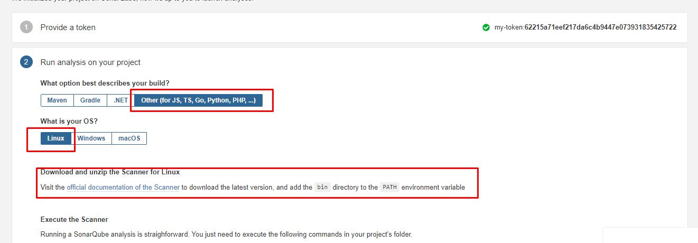

# Домашнее задание к занятию "9.Процессы CI/CD"

## Подготовка к выполнению

---
#### 1. Создаём 2 VM в yandex cloud со следующими параметрами: 2CPU 4RAM Centos7(остальное по минимальным требованиям)

        1) На management хосте создадем  нового юзера bes,отличного от root .  
        2) Сгенерировал для него ключ id_rsa.pub .  
        3) на YC под данным юзером  cоздаем 2 виртуалки с заданными параметрами .   
        4) Вносим данного пользователя в файл hosts.yml

#### 2. Прописываем в [inventory](./infrastructure/inventory/cicd/hosts.yml) [playbook'a](./infrastructure/site.yml) созданные хосты  . Добавляем в hosts.yml юзера bes  .
#### 3. Добавляем в [files](./infrastructure/files/) файл со своим публичным ключом юзера  bes (id_rsa.pub).
#### 4. Выполняем проверку кода ./infrastructure/site.yml  с помощью ansible-lint  . Исправляем ошибки . Меняем  собственника на директорю проекта на bes .
#### 5. Запускаем playbook, ожидаем успешного завершения.
#### 6. Проверяем готовность Sonarqube через [браузер](http://158.160.46.194:9000)

7. Заходим под admin\admin, меняем пароль на свой -admin123
8. Проверяем готовность Nexus через [браузер](http://158.160.18.219:8081)
9. Подключаемся под admin\admin123, меняем пароль а admin456, сохраняем анонимный доступ

## Знакомоство с SonarQube

### Основная часть

1. Создаём новый проект "My first project" . Выбираем локальный инструмент анализа кода .

2. Генерим уникальный  токен проекта:

3. Скачиваем и устанавливаем на management-хост пакет sonar-scanner, который нам предлагает скачать сам sonarqube по ссылке
   [https://docs.sonarqube.org/latest/analyzing-source-code/scanners/sonarscanner/]

 
      
4. Делаем так, чтобы binary был доступен через вызов в shell (или меняем переменную PATH или любой другой удобный вам способ)
5. Проверяем `sonar-scanner --version`
6. Запускаем анализатор против кода из директории [example](./example) с дополнительным ключом `-Dsonar.coverage.exclusions=fail.py`
7. Смотрим результат в интерфейсе
8. Исправляем ошибки, которые он выявил(включая warnings)
9. Запускаем анализатор повторно - проверяем, что QG пройдены успешно
10. Делаем скриншот успешного прохождения анализа, прикладываем к решению ДЗ

## Знакомство с Nexus

### Основная часть

1. В репозиторий `maven-public` загружаем артефакт с GAV параметрами:
   1. groupId: netology
   2. artifactId: java
   3. version: 8_282
   4. classifier: distrib
   5. type: tar.gz
2. В него же загружаем такой же артефакт, но с version: 8_102
3. Проверяем, что все файлы загрузились успешно
4. В ответе присылаем файл `maven-metadata.xml` для этого артефекта

### Знакомство с Maven

### Подготовка к выполнению

1. Скачиваем дистрибутив с [maven](https://maven.apache.org/download.cgi)
2. Разархивируем, делаем так, чтобы binary был доступен через вызов в shell (или меняем переменную PATH или любой другой удобный вам способ)
3. Удаляем из `apache-maven-<version>/conf/settings.xml` упоминание о правиле, отвергающем http соединение( раздел mirrors->id: my-repository-http-unblocker)
4. Проверяем `mvn --version`
5. Забираем директорию [mvn](./mvn) с pom

### Основная часть

1. Меняем в `pom.xml` блок с зависимостями под наш артефакт из первого пункта задания для Nexus (java с версией 8_282)
2. Запускаем команду `mvn package` в директории с `pom.xml`, ожидаем успешного окончания
3. Проверяем директорию `~/.m2/repository/`, находим наш артефакт
4. В ответе присылаем исправленный файл `pom.xml`

---

### Как оформить ДЗ?

Выполненное домашнее задание пришлите ссылкой на .md-файл в вашем репозитории.

---
