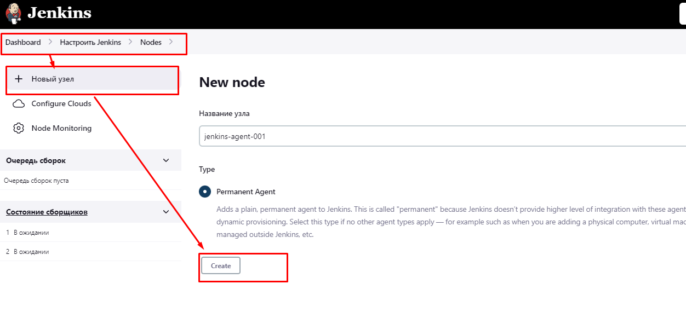

# Домашнее задание к занятию "10.Jenkins"

---
## Подготовка к выполнению

## 1. Создаём 2 VM: для jenkins-master и jenkins-agent.

    1) На management хосте создаём  нового юзера bes ,отличного от root .  
    2) Генерируем для него ключ id_rsa.pub .  
    3) На YC под данным юзером  cоздаем 2 виртуалки с заданными параметрами .   
    4) Вносим данного пользователя bes  в файл hosts.yml
---

---

## 2. Прописываем в [inventory](./infrastructure/inventory/cicd/hosts.yml) [playbook'a](./infrastructure/site.yml) созданные хосты.

## 3. Проверяем линтером ansible-lint  файл  [playbook'a](./infrastructure/site.yml)  на ошибки. Исправляем ошибки .

## 4. Устанавливаем используемую библиотеку ansible.posix

    [root@centos-host 09-ci-04-jenkins]#  sudo ansible-galaxy collection install ansible.posix

## 5. Меняем собственника на директорию проекта на пользователя bes.

    [root@centos-host 09-ci-04-jenkins]#  chown -R bes:bes ./infrastructure/

## 6. Запускаем сеанс пользователя bes на management хосте.
        
    [root@centos-host infrastructure]#  su bes

## 7. !!!!  На management хосте входим в cecсию юзера bes и из-под него разово открываем ssh-соединение с каждым из созданных хостов !!!! иначе плейбук зависнет.

## 8. Устанавливаем  jenkins при помощи playbook'a.  Для этого запускаем и проверяем работоспособность плейбука для развертывания двух серверов - jenkins-master  и  jenkins-agent 
          
    [bes@centos-host infrastructure]$    ansible-playbook  -i inventory/cicd/hosts.yml site.yml

## 9. Выполняем первоначальную настройку Jenkins.

### 1) Входим на удаленный хост и забирем дефолтовый пароль

      [bes@jenkins-master-001 ~]$ sudo cat /var/lib/jenkins/secrets/initialAdminPassword   -  d068cf767e0940d99d64480ed78e37bf

### 2) Входим в интерфейс через браузер http://62.84.122.87:8080/  и вводим вышеуказанный пароль чтобы разблокировать.   

---
### 3) Запускаем установку плагинов

### 4) Создаем нового админа и его пароль.

### 5) Записываем строку подключения со стороны внешних репозиториев ( bitbucket, gitgub etc.) - http://62.84.122.87:8080/
---
### 6) Настраиваем внешний узел-агент.

---
### 7) Указываем рабочий каталог и команду запуска процесса JAVA на узле-агенте. Путь берем из переменной jenkins_agent_dir проекта: ( /opt/jenkins_agent/ )

---
### 8) Отключаем все внутренние executors-сборщики на мастере. 

---
### 9) Убеждаемся что используются только сборщики на удаленном агенте.

---
## Основная часть

---
### 1. Создаем  Freestyle Job, который будет запускать `molecule test` из любого вашего репозитория с ролью.
на основании документов https://github.com/alainchiasson/docker-molecule  и
https://molecule.readthedocs.io/en/latest/ci.html ( Раздел "Jenkins Pipeline" )
   

    

---
### 2. Создаем  Declarative Pipeline Job, который будет запускать `molecule test` из любого вашего репозитория с ролью.

  В сценарии предусматриваем:
   1) Установку пакета-фреймворка molecule.
   2) Установку линтеров YAMLLINT и  ANSIBLE-LINT  .

---
### 3. Убеждаемся, что необходимые линтеры YAMLLINT и  ANSIBLE-LINT установлены:

            root@dockerhost:/# pip3 install ansible-lint yamllint
            root@dockerhost:/# yamllint --version
            yamllint 1.28.0

            root@dockerhost:/# ansible-lint --version
            ansible-lint 6.8.6 using ansible 2.13.6
            A new release of ansible-lint is available: 6.8.6 → 6.10.0

            root@dockerhost:/# pip3 install git+https://github.com/ansible/ansible-lint.git
            Successfully installed ansible-compat-2.2.7 ansible-lint-6.10.1.dev2 pyyaml-6.0
            root@dockerhost:/home/bes/vector-role/molecule/default# ansible-lint --version
            ansible-lint 6.10.1.dev2 using ansible 2.13.6
            You are using a pre-release version of ansible-lint.
   
---
### 4. Переносим готовый скрипт для конвейера Declarative Pipeline в репозиторий в файл `/pipeline/Jenkinsfile`.

####    4.1 Переходим в настройки Jenkins "Dashboard" > Настройка Jenkins ( "Manage Jenkins" ) > Глобальные настройки безопасности( "Configure Global Security" ) >"Git Host Key Verification Configuration". В раскрывающемся списке "Host Key Verification Strategy" выбираем  "Accept first connection".   

---

####    4.2  Входим на Jenkins-master хост и открываем сессию пользователя jenkins ( от имени которого исполняется сервер Jenkins) 
Можно сразу использовать готовые ключи созданные черех сценарий  в папке ~/.ssh  или сгенерировать новые.

              [root@jenkins-master-001 ~]# su genkins

####    4.3 Предварительно очищаем все старые ключи доступа  к  GITHUB-репозиторию с именем git .

####    4.4 В настройках pipeline указываем GIT репозиторий  - git@github.com:edward-burlakov/jenkins-test.git с файлом /pipeline/Jenkinsfile

####    4.5 Генерируем пару ключей на хосте jenkins-master.

              [jenkins@jenkins-master-001 ~]$ ssh-keygen -t ecdsa -lf id_rsa.pub

####    4.6 Сначала добавляем Паблик-ключ  ~/.ssh/:id_rsa.pub   на сервер GITHUB.

              [jenkins@jenkins-master-001 ~]$ cat  ~/.ssh/id_rsa.pub
              ssh-rsa AAAAB3NzaC1yc2EAAAADA.....qjiH94Hbzi7OyHjHlQqI81Z2McQj bes@jenkins-agent-001.ru-central1.internall

####    4.7 Копируем приватный ключ ~/.ssh/ssh/id_rsa с хоста jenkins-master, на котором уже есть доступ к данному репозиторию и добавляем в pipeline. 

              [bes@jenkins-master-001 ~]$ cat  ~/.ssh/id_rsa 

####    4.8 Проверяем доступность сервера GITHUB  
              [root@jenkins-master-001 jenkins-test]# ssh -T git@github.com
              Hi edward-burlakov/jenkins-test! You've successfully authenticated, but GitHub does not provide shell access.

--- 

---

---            
 
4. Создать Multibranch Pipeline на запуск `Jenkinsfile` из репозитория.
6. Создать Scripted Pipeline, наполнить его скриптом из [pipeline](./pipeline).
7. Внести необходимые изменения, чтобы Pipeline запускал `ansible-playbook` без флагов `--check --diff`, если не установлен параметр при запуске джобы (prod_run = True), по умолчанию параметр имеет значение False и запускает прогон с флагами `--check --diff`.
8. Проверить работоспособность, исправить ошибки, исправленный Pipeline вложить в репозиторий в файл `ScriptedJenkinsfile`.
9. Отправить ссылку на репозиторий с ролью и Declarative Pipeline и Scripted Pipeline.
