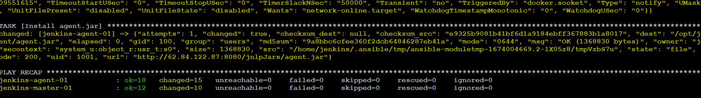

# Домашнее задание к занятию "10.Jenkins"

---
## Подготовка к выполнению

## 1. Создаём 2 VM: для jenkins-master и jenkins-agent.

    1) На management хосте создаём  нового юзера bes ,отличного от root .  
    2) Генерируем для него ключ id_rsa.pub .  
    3) На YC под данным юзером  cоздаем 2 виртуалки с заданными параметрами .   
    4) Вносим данного пользователя bes  в файл hosts.yml
---

---

## 2. Прописываем в [inventory](./infrastructure/inventory/cicd/hosts.yml) [playbook'a](./infrastructure/site.yml) созданные хосты.

## 3. Проверяем линтером ansible-lint  файл  [playbook'a](./infrastructure/site.yml)  на ошибки. Исправляем ошибки .

## 4. Устанавливаем используемую библиотеку ansible.posix

    [root@centos-host 09-ci-04-jenkins]#  sudo ansible-galaxy collection install ansible.posix

## 5. Меняем собственника на директорию проекта на пользователя bes.

    [root@centos-host 09-ci-04-jenkins]#  chown -R bes:bes ./infrastructure/

## 6. Запускаем сеанс пользователя bes на management хосте.
        
    [root@centos-host infrastructure]#  su bes

## 7. !!!!  На management хосте входим в cecсию  юзера bes и из-под него разово открываем ssh-соединение с каждым из созданных хостов !!!! иначе плейбук зависнет.

## 8. Устанавливаем  jenkins при помощи playbook'a.  Дяя этого запускам и проверяем работоспособность плейбука для развертывания двух серверов - jenkins-master  и  jenkins-agent 
          
    [bes@centos-host infrastructure]$    ansible-playbook  -i inventory/cicd/hosts.yml site.yml

## 9. Выполняем первоначальную настройку Jenkins.

### 1)   [bes@jenkins-master-001 ~]$ sudo cat /var/lib/jenkins/secrets/initialAdminPassword   -  d068cf767e0940d99d64480ed78e37bf

### 2) Входим в интерфейс через браузер http://62.84.122.87:8080/login?from=%2F  и вводим вышеуказанный пароль  чтобы разблокировать.   

### 3) Запускаем установку плагинов

### 4) Создаем нового админа и его пароль.

### 5) Записываем  строку подлючения со стороны  внешних репозиториев ( bitbucket, gitgub etc.) - http://62.84.122.87:8080/

### 6) Настраиваем внешний узел- агент.

### 7) Указываем рабочих каталог и  коману запуска процесса JAVA на узле-агенте  . Путь берем из переменной jenkins_agent_dir: ( /opt/jenkins_agent/ )

### 8) Отключаем внутренние executors- сборщики  на мастере . 

###      9) Убеждаемся что ипользуются только сборщики на удаленном агенте.

---
## Основная часть

1. Сделать Freestyle Job, который будет запускать `molecule test` из любого вашего репозитория с ролью.
   

2. Сделать Declarative Pipeline Job, который будет запускать `molecule test` из любого вашего репозитория с ролью.
3. Перенести Declarative Pipeline в репозиторий в файл `Jenkinsfile`.
4. Создать Multibranch Pipeline на запуск `Jenkinsfile` из репозитория.
5. Создать Scripted Pipeline, наполнить его скриптом из [pipeline](./pipeline).
6. Внести необходимые изменения, чтобы Pipeline запускал `ansible-playbook` без флагов `--check --diff`, если не установлен параметр при запуске джобы (prod_run = True), по умолчанию параметр имеет значение False и запускает прогон с флагами `--check --diff`.
7. Проверить работоспособность, исправить ошибки, исправленный Pipeline вложить в репозиторий в файл `ScriptedJenkinsfile`.
8. Отправить ссылку на репозиторий с ролью и Declarative Pipeline и Scripted Pipeline.

## Необязательная часть

1. Создать скрипт на groovy, который будет собирать все Job, которые завершились хотя бы раз неуспешно. Добавить скрипт в репозиторий с решением с названием `AllJobFailure.groovy`.
2. Создать Scripted Pipeline таким образом, чтобы он мог сначала запустить через Ya.Cloud CLI необходимое количество инстансов, прописать их в инвентори плейбука и после этого запускать плейбук. Тем самым, мы должны по нажатию кнопки получить готовую к использованию систему.

---

### Как оформить ДЗ?

Выполненное домашнее задание пришлите ссылкой на .md-файл в вашем репозитории.

---
